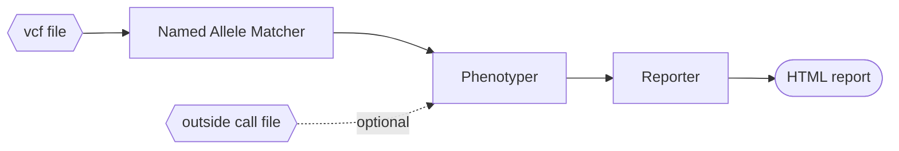

# Running the PharmCAT Tool

This document teaches you how to use the core PharmCAT tool.


## Prerequisites

This assumes that you are either [using Docker](/using/PharmCAT-in-Docker) or have already
[set up PharmCAT](/using/Setup-PharmCAT).


### Prepare Your VCF Files

PharmCAT takes VCF files as input.

{: .warn}
Please make sure you have read and understand PharmCAT's [VCF requirements](/using/VCF-Requirements).
<br /><br />
If you are not preparing your VCF files yourself, we highly recommend you run your VCF file through PharmCAT's
[VCF Preprocessor](/using/VCF-Preprocessor).


## Running PharmCAT

This is the basic command, which will take your VCF file and produce the PharmCAT report:

```console
# java -jar <path_to_pharmcat_jar_file> -vcf <vcf_file>
```

Where:

-jar `<path_to_jar_file>`
: The compiled PharmCAT Jar file

-vcf `<vcf_file>`
: Input VCF file (must comply with PharmCAT's [VCF requirements](/using/VCF-Requirements))

By default, the output will be saved to the same directory as the input VCF file and will use the same base file name.  For example:

```console
# java -jar pharmcat.jar -vcf /tmp/sample1.vcf
Saving named allele matcher JSON results to /tmp/sample1.match.json
Saving phenotyper JSON results to /tmp/sample1.phenotype.json
Saving reporter HTML results to /tmp/sample1.report.html
```

Notice that all intermediary files will be kept.

To control this behavior, provide:


-o `<dir>` <span class="altArg"><br />or --output-dir `<dir>`</span>
: Directory to save files to

-bf `<name>` <span class="altArg"><br />or --base-filename `<name>`</span>
: The base name (without file extensions) used for output files

-del <span class="altArg"><br />or --delete-intermediary-files</span>
: Delete intermediary output files

Example:

```console
# java -jar pharmcat.jar -vcf /tmp/input.vcf -o /tmp/results -bf sample
Saving named allele matcher JSON results to /tmp/results/sample.match.json
Saving phenotyper JSON results to /tmp/results/sample.phenotype.json
Saving reporter HTML results to /tmp/results/sample.report.html

# java -jar pharmcat.jar -vcf /tmp/input.vcf --output-dir /tmp/results -del
Saving reporter HTML results to /tmp/results/input.report.html
```

If the provided VCF file contains multiple samples, you can limit which samples get processed with either:

-S `<txt_file>` <span class="altArg"><br />or --sample-file `<txt_file>`</span>
: The list of samples to be processed and prepared for PharmCAT. The file should contain one sample per line.

-s `<samples>` <span class="altArg"><br />or --samples `<samples>`</span>
: A comma-separated list of sample IDs.

-sm `<tsv_file>` <span class="altArg"><br />or --sample-metadata `<tsv_file>`</span>
: A TSV file containing sample metadata.


### Outside Calls

If you need to provide diplotypes directly to PharmCAT,
you can do so using an ["outside calls" file](/using/Outside-Call-Format).
You might want to do this for genes that PharmCAT does not call directly, or to override PharmCAT's call.

To do so, provide:

-po `<tsv_file>` <span class="altArg"><br />or --phenotyper-outside-call-file `<tsv_file>`</span>
: Path to an outside call file (TSV)

Example:

```console
# java -jar pharmcat.jar -vcf /tmp/sample.vcf -po /tmp/outside_calls.tsv
Saving named allele matcher JSON results to /tmp/results/sample.match.json
Saving phenotyper JSON results to /tmp/results/sample.phenotype.json
Saving reporter HTML results to /tmp/results/sample.report.html
```


## Advanced Usage

Remember that the PharmCAT tool is composed of 3 modules:  the `Named Allele Matcher`, the `Phenotyper`, and the `Reporter`.



Each module has its own arguments to customize its behavior.

#### Named Allele Matcher

-matcher
: run Named Allele Matcher

-ma <span class="altArg"><br />or --matcher-all-results</span>
: return all possible diplotypes, not just top hits

-matcherHtml <span class="altArg"><br />or --matcher-save-html</span>
: save named allele matcher results as HTML

#### Phenotyper

-phenotyper
: run Phenotyper

-pi `<json_file>` <span class="altArg"><br />or --phenotyper-input `<json_file>`</span>
: JSON results from named allele matcher

-po  `<tsv_file>` <span class="altArg"><br />or --phenotyper-outside-call-file `<tsv_file>`</span>
: path to an outside call file (TSV)

#### Reporter

-reporter
: run Reporter

-ri `<json_file>` <span class="altArg"><br />or --reporter-input `<json_file>`</span>
: JSON results from phenotyper

-rt `<title>` <span class="altArg"><br />or --reporter-title `<title>`</span>
: text to add to the report title

-rs `<CPIC, DPWG or FDA>` <span class="altArg"><br />or --reporter-sources `<CPIC, DPWG or FDA>`</span>
: comma-separated list of sources to limit recommendations to (defaults to all)

-re <span class="altArg"><br />or --reporter-extended</span>
: write an extended report (includes all possible genes and drugs, even if no data is available)

-reporterHtml <span class="altArg"><br />or --reporter-save-html
: save reporter results as HTML. This is the default if no format is specified.
If any format is specified, only the specified formats will be saved.

-reporterJson <span class="altArg"><br />or --reporter-save-json
: save reporter results as JSON

-reporterCallsOnlyTsv <span class="altArg"><br />or --reporter-save-calls-only-tsv
: save call results only as TSV


### Running Individual Modules

#### Just the `Named Allele Matcher`

This will call the diplotypes for the input VCF file.

Examples:

```console
# java -jar pharmcat.jar -matcher -vcf /tmp/sample.vcf
Saving named allele matcher JSON results to /tmp/sample.match.json
```

#### Just the `Phenotyper`

This will take matcher and/or call data and output function and phenotype information for them.

Examples:

```console
# java -jar pharmcat.jar -phenotyper -pi /tmp/sample1.match.json
Saving phenotyper JSON results to /tmp/results/sample1.phenotype.json

# java -jar pharmcat.jar -phenotyper -pi /tmp/sample2.match.json -po /tmp/outside_calls.tsv
Saving phenotyper JSON results to /tmp/results/sample2.phenotype.json

# java -jar pharmcat.jar -phenotyper -po /tmp/outside_calls.tsv
Saving phenotyper JSON results to /tmp/results/outside_calls.phenotype.json
```

#### Just the `Reporter`

This will take the `Phenotyper` data and output the relevant drug annotations in a comprehensive HTML report.

Examples:

```console
# java -jar pharmcat.jar -reporter -ri /tmp/sample1.phenotype.json
Saving reporter HTML results to /tmp/results/sample1.report.html

# java -jar pharmcat.jar -reporter -ri /tmp/sample2.phenotype.json -rt "Awesome Report" -reporterJson
Saving reporter JSON results to /tmp/results/sample1.report.json
Saving reporter HTML results to /tmp/results/sample1.report.html
```


#### Combinations

Run `Named Allele Matcher` and `Phenotyper`:

```console
# java -jar pharmcat.jar -matcher -vcf /tmp/sample1.vcf -phenotyper
Saving named allele matcher JSON results to /tmp/sample1.match.json
Saving phenotyper JSON results to /tmp/results/sample1.phenotype.json

# java -jar pharmcat.jar -matcher -vcf /tmp/sample2.vcf -phenotyper -po /tmp/outside_calls.tsv
Saving named allele matcher JSON results to /tmp/sample2.match.json
Saving phenotyper JSON results to /tmp/results/sample2.phenotype.json
```

Run `Phenotyper` and `Reporter`:

```console
# java -jar pharmcat.jar -phenotyper -pi /tmp/sample1.phenotype.json -po /tmp/outside_calls.tsv -reporter
Saving phenotyper JSON results to /tmp/results/sample1.phenotype.json
Saving reporter HTML results to /tmp/results/sample1.report.html

# java -jar pharmcat.jar -phenotyper -po /tmp/outside_calls.tsv -reporter
Saving phenotyper JSON results to /tmp/results/outside_calls.phenotype.json
Saving reporter HTML results to /tmp/results/outside_calls.report.html
```


### Research Mode Options

PharmCAT has functionality meant for **research use only**. You can read about these features on the [Research Mode](/using/Research-Mode) page.


### Custom Definition Files

Advanced users can provide PharmCAT with custom allele definitions:

-def `<dir>` <span class="altArg"><br />or --definitions-dir `<dir>`</span>
: directory containing named allele definitions (JSON files)

This can be used to get PharmCAT to call diplotypes for genes that PharmCAT does not support by default.
Unless these are genes that PharmCAT supports through [outside calls](/Genes-Drugs/#genes-handled-by-outside-callers),
PharmCAT will **NOT** be able to match them to any recommendations.


## Output Files

See [Naming Conventions](/using/running-pharmcat-pipeline/#naming-conventions) for details on how PharmCAT's output 
files are named.

### Calls-Only TSV Reports

If given the `-reporterCallsOnlyTsv` flag, PharmCAT will produce a TSV file that captures a condensed version of the
results from the `Named Allele Matcher` and the `Phenotyper`.  It will have the following columns:

1. Gene
2. Source Diplotype - the diplotype called by the `Named Allele Matcher`, or via outside call if one was provided
3. Phenotype
4. Activity Score
5. Haplotype 1
6. Haplotype 1 Function
7. Haplotype 1 Activity Value
8. Haplotype 2
9. Haplotype 2 Function
10. Haplotype 2 Activity Value
11. Outside Call - yes/no if the _Source Diplotype_ comes from an [outside call](#outside-calls)
12. Match Score - the diplotype [match score](/methods/namedallelematcher-101/#scoring) from the `Named Allele Matcher`
    (this is only available for some genes)
13. Missing positions - [positions expected by PharmCAT](https://github.com/PharmGKB/PharmCAT/releases/latest) that were
    not present in the VCF
14. Recommendation Lookup Diplotype - the diplotype used to look up the phenotype (and activity score, if appropriate)
    that is used to map to a clinical prescribing recommendation
    ([see below](#recommendation-lookup-columns) for details)
15. Recommendation Lookup Phenotype - the phenotype (based on the _Recommendation Lookup Diplotype_
    unless it comes from an outside call) used to map to a clinical prescribing recommendation
    ([see below](#recommendation-lookup-columns) for details)
16. Recommendation Lookup Activity Score - the activity score (based on the _Recommendation Lookup Diplotype_
    unless it comes from an outside call) used to map to a clinical prescribing recommendation
    ([see below](#recommendation-lookup-columns) for details)


#### _Source Diplotype_ Column

The _Source Diplotype_ column can have multiple entries!

If the `Named Allele Matcher` is unable to call a single diplotype (either because the data is not phased or the data is
incomplete), all the potential diplotypes will be concatenated together with an " OR ".

For example:
```tsv
CYP2B6	*4/[*6 + *10] OR *6/[*4 + *10]								no	9 / 9			
```

When this happens, phenotype, activity score, haplotype and recommendation lookup columns are left blank.

For frequency analysis, this should effectively be treated as unknown.

If this happens with genes that use the two lowest function variants to calculate phenotype/activity score,
such as [DPYD](/methods/Gene-Definition-Exceptions/#dpyd) and [RYR1](/methods/Gene-Definition-Exceptions/#ryr1),
the calls will be separated with an " AND ".

For example:
```tsv
DPYD	c.775A>G AND c.1627A>G (*5)									no		c.775A>G/c.1627A>G (*5)	Normal Metabolizer	2.0
```

For frequency analysis, _all_ alleles should be counted.


#### _Recommendation Lookup_ Columns

The diplotype/phenotype/activity score used for recommendation lookup may not be the same as what is called by the
`Named Allele Matcher`.
See [Matching Recommendations](/methods/Matching-Recommendations/) and
[Gene Definition Exceptions](https://markwoon.pharmcat.org/methods/Gene-Definition-Exceptions/) for details.

If sourced from an outside call, these fields be whatever was specified by the outside call.


### Sample Metadata

PharmCAT accepts arbitrary sample metadata (e.g. biogeographic data) via the `-sm` flag to specify a TSV file that has
3 columns:

1. Sample ID
2. Property key
3. Property value

For example:
```tsv
Sample_1	Biogeographic Group	European
Sample_1	Gender	Male
Sample_2	Biogeographic Group	Central/South Asian
Sample_2	Gender	Female
```

While the order of the properties does not matter, metadata for a single sample must be sequential.
For example, this is invalid:
```tsv
Sample_1	Biogeographic Group	European
Sample_2	Biogeographic Group	Central/South Asian
Sample_1	Gender	Male
Sample_2	Gender	Female
```

For now, this information is only used when generating the [calls-only TSV reports](#calls-only-tsv-reports).
It will be added as additional columns after the standard columns.  
The example above would add 2 columns: _Biogeographic Group_ and _Gender_.
